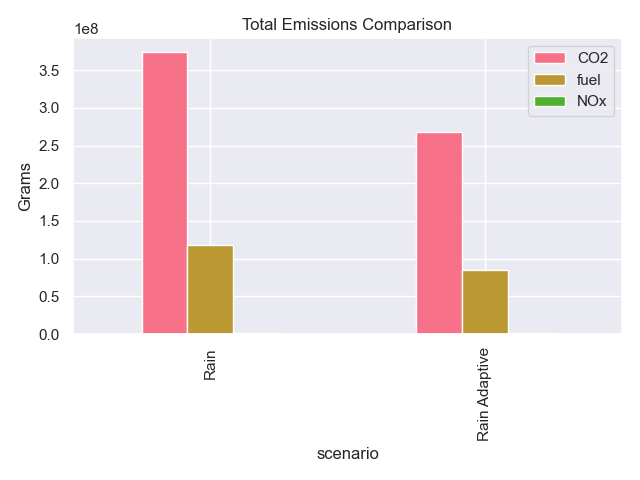
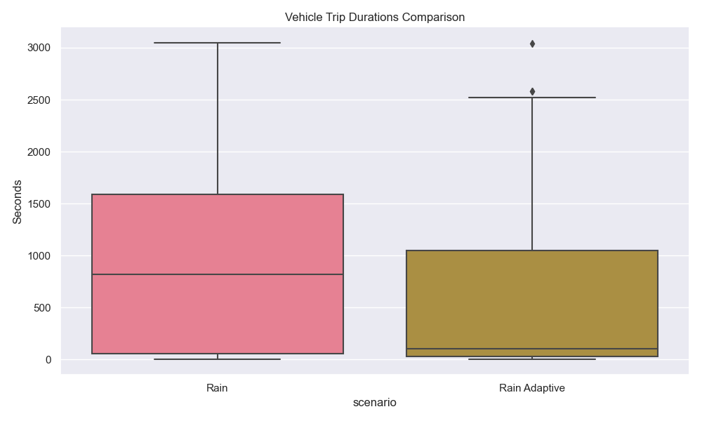
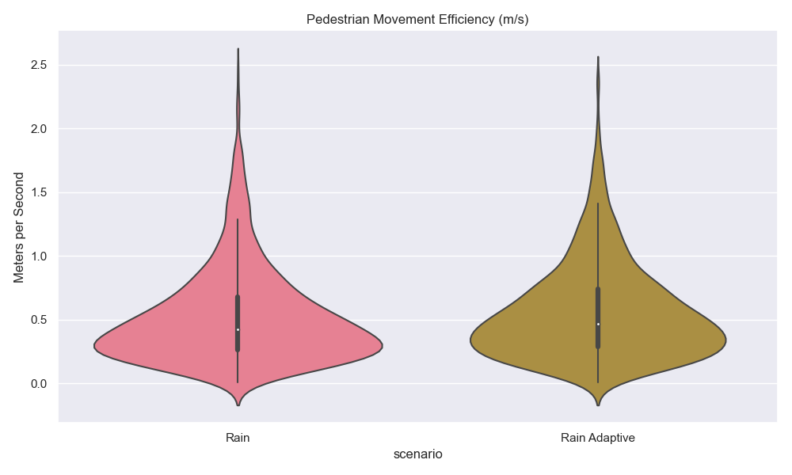
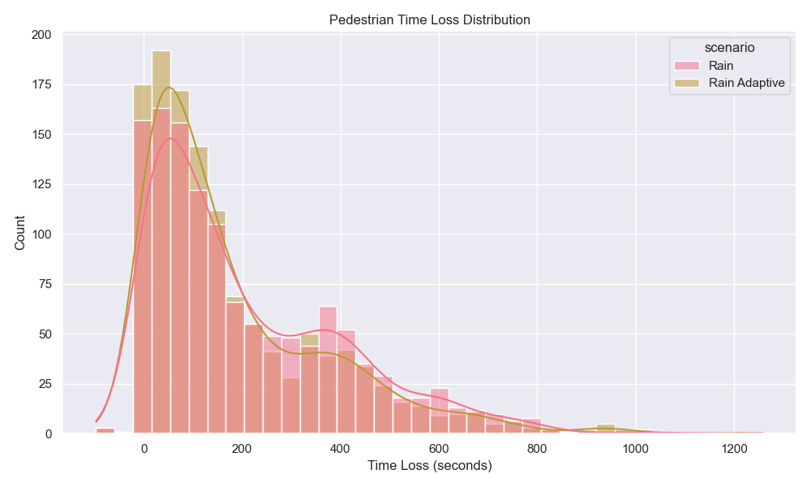
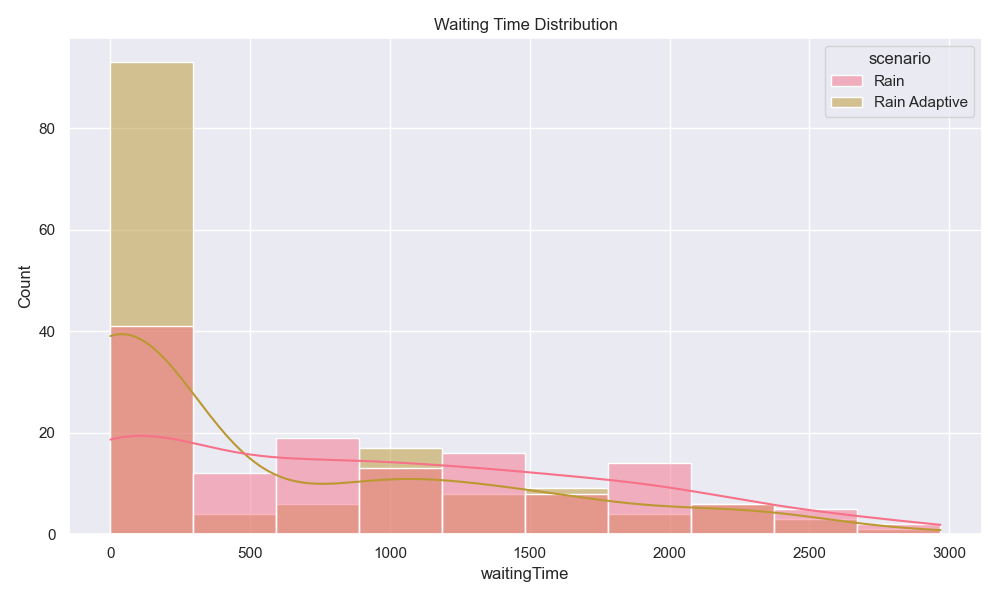
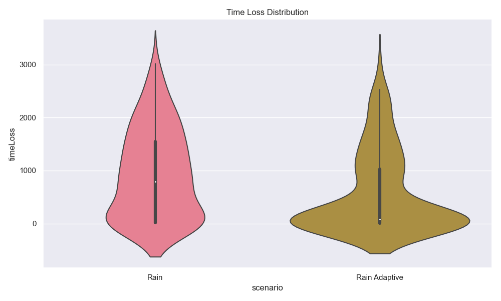
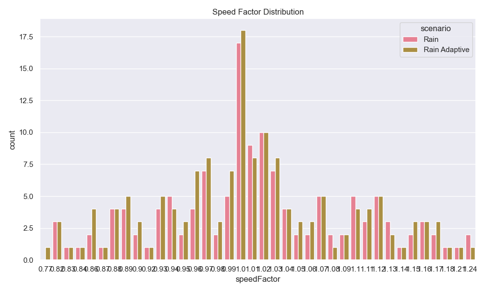
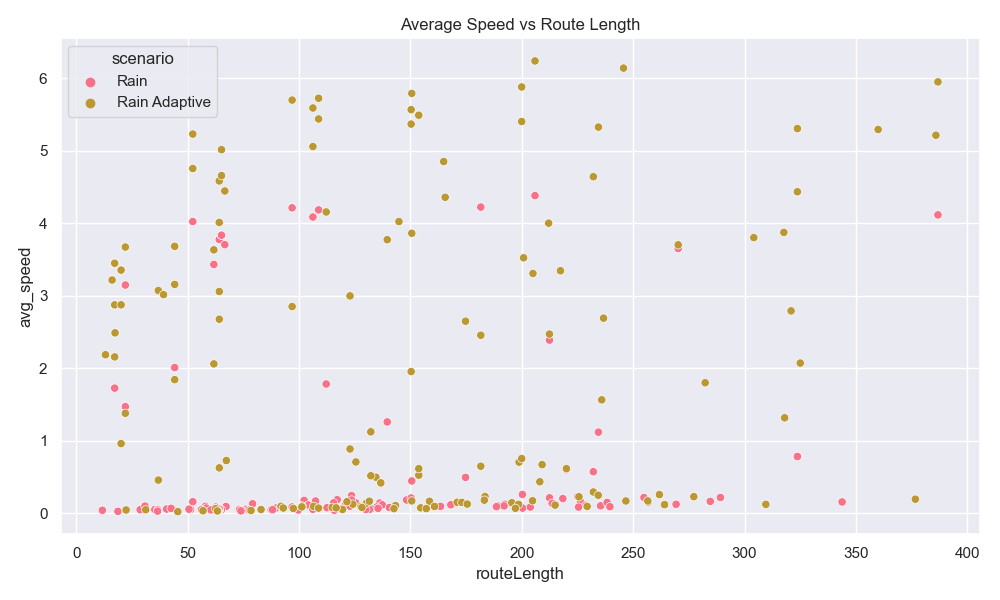
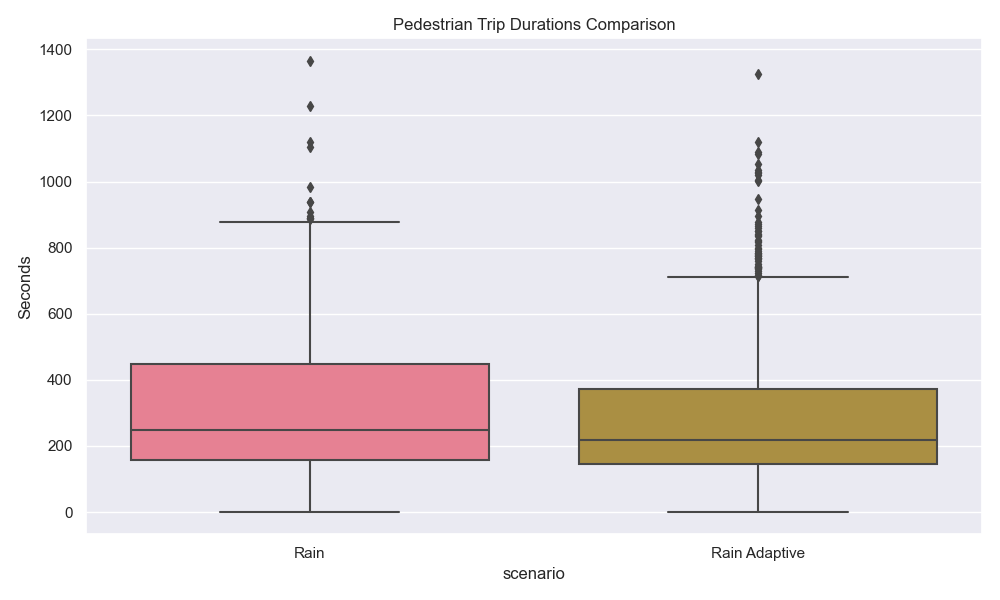
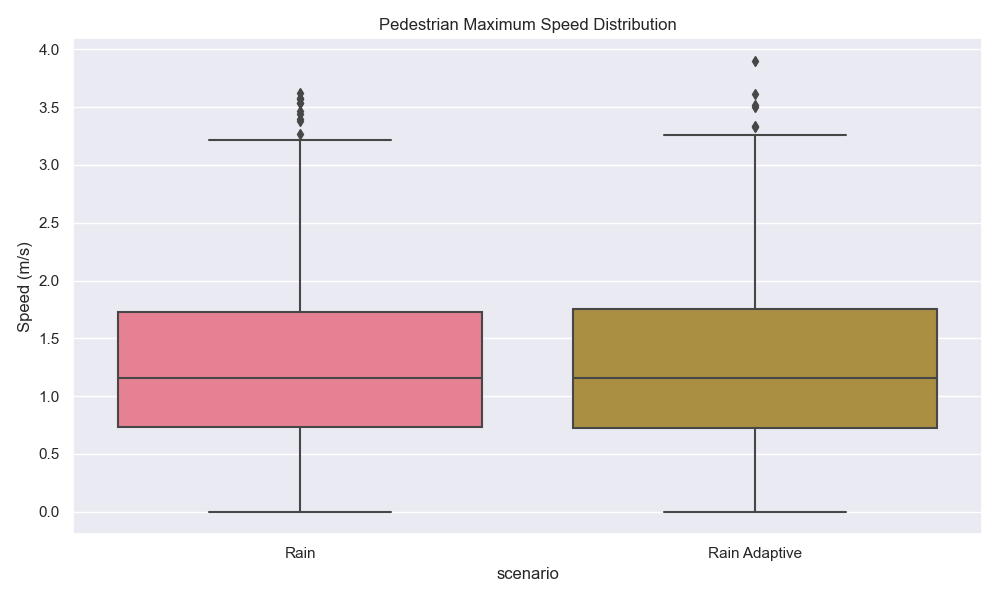

# Optimizing Traffic Flow Using Data-Driven Simulation Models
### Rain-Adaptive Pedestrian Priority System | MSc Major Project

A data-driven traffic simulation project that models and analyses the impact of a **rain-adaptive pedestrian priority system** on urban traffic flow, pedestrian safety, and environmental performance. Built using SUMO (Simulation of Urban Mobility), Python, and Jupyter Notebook, with a focus on Trafalgar Square, London.

---

## Project Overview

Traditional traffic signal systems operate on fixed timers that do not account for adverse weather conditions. This project addresses that gap by designing a simulation that **dynamically adjusts pedestrian signal timings and vehicle speeds based on real-world historical rainfall data**.

Two scenarios were simulated and compared:
- **Rain Scenario** — standard rain conditions with no adaptive logic
- **Rain-Adaptive Scenario** — dynamic signal adjustments triggered by rainfall intensity

---

## Key Results

| Metric | Rain | Rain Adaptive | Difference (%) |
|--------|------|---------------|----------------|
| Average Vehicle Travel Time (s) | 962.80 | 597.68 | -37.92% |
| Total CO₂ Emissions (kg) | 373,357.25 | 267,400.63 | -28.38% |
| Average Pedestrian Speed (m/s) | 0.52 | 0.56 | +7.24% |
| Total Fuel Consumption (L) | 118,625.43 | 84,926.19 | -28.41% |
| Vehicle Time Loss (%) | 97.02 | 96.01 | -1.04% |
| Pedestrian Time Loss (%) | 66.46 | 63.45 | -4.53% |

> The rain-adaptive system reduced average vehicle travel time by **37.92%**, cut CO₂ emissions by over **28%**, and improved pedestrian movement efficiency by **7.24%**, all without compromising vehicle throughput.

---

## Visualisations

### Total Emissions Comparison


### Vehicle Trip Durations


### Pedestrian Movement Efficiency


### Pedestrian Time Loss Distribution


### Waiting Time Distribution


### Time Loss Distribution


### Speed Factor Distribution


### Average Speed vs Route Length


### Pedestrian Trip Durations


### Pedestrian Maximum Speed Distribution


---

## Repository Structure

```
Optimizing_Traffic_Flow_Using_Data_Driven_Simulation_Models/
│
├── project_simulation_analysis.ipynb   # Jupyter Notebook — full analysis & visualisations
├── Rain_Adaptive_Traffic_Simulation_Report.pdf  # Full MSc project report
├── README.md
│
├── scripts/
│   ├── generate_rain_scenario_update.py         # Generates standard rain scenario
│   └── generate_rain_adaptive_scenario.py       # Generates rain-adaptive scenario
│
├── data/
│   └── weather/
│       └── historical_rain_data.csv             # Real-world rainfall dataset (100 entries)
│
├── scenarios/
│   ├── baseline/                                # Baseline simulation config files
│   ├── rain/                                    # Rain scenario config files
│   └── rain adaptive/                           # Rain-adaptive scenario config files
│
└── images/                                      # All chart outputs from the notebook
```

> **Note:** The `output/` folder containing raw SUMO simulation XML files is excluded from this repository due to file size (~90MB). To regenerate the output, follow the simulation guide below.

---

## How to Run the Simulation

### Prerequisites
- [SUMO](https://sumo.dlr.de/docs/Installing/index.html) installed on your machine
- Python 3.x
- Required Python libraries: `pandas`, `matplotlib`, `seaborn`, `xml.etree.ElementTree`

### Steps

**1. Clone the repository**
```bash
git clone https://github.com/ayodejijaks/Optimizing_Traffic_Flow_Using_Data_Driven_Simulation_Models.git
cd Optimizing_Traffic_Flow_Using_Data_Driven_Simulation_Models
```

**2. Generate the rain scenario**
```bash
python scripts/generate_rain_scenario_update.py
```

**3. Generate the rain-adaptive scenario**
```bash
python scripts/generate_rain_adaptive_scenario.py
```

**4. Run the simulations in SUMO**
- Open SUMO GUI
- Load the config files from the `scenarios/rain/` and `scenarios/rain adaptive/` folders
- Run each simulation and save outputs to an `output/` folder

**5. Run the analysis notebook**
```bash
jupyter notebook project_simulation_analysis.ipynb
```

---

## Rainfall Classification Logic

Rainfall intensity thresholds are based on UK Met Office specifications:

| Category | Intensity | Pedestrian Walk Time | Vehicle Speed |
|----------|-----------|----------------------|---------------|
| None | 0 mm/h | 30s | 13.89 m/s |
| Light | < 5 mm/h | 45s | 11.5 m/s |
| Moderate | 5–15 mm/h | 60s | 9.0 m/s |
| Heavy | > 15 mm/h | 90s | 7.0 m/s |

---

## Tools & Technologies

- **SUMO** — microscopic traffic simulation
- **Python** — scenario generation and logic scripting (TraCI API, ElementTree, Pandas)
- **Jupyter Notebook** — simulation output analysis and visualisation
- **Seaborn / Matplotlib** — data visualisation
- **OpenStreetMap** — real-world road network (Trafalgar Square, London)
- **NETCONVERT / NETEDIT** — SUMO network tools

---

## Full Report

The complete MSc project report is available in this repository:
📄 [Rain_Adaptive_Traffic_Simulation_Report.pdf](Rain_Adaptive_Traffic_Simulation_Report.pdf)

It covers the literature review, methodology, system design, implementation, results, discussion, and recommendations in full.

---

## Author

**Ayodeji Jakande**
MSc Information and Communication Technology — Anglia Ruskin University
[LinkedIn](https://www.linkedin.com/in/ayodeji-jakande-5a4054325/)

---

## Acknowledgements

Supervised by Dr C.M. Tang, Anglia Ruskin University. Data sourced from historical rainfall records and OpenStreetMap.
